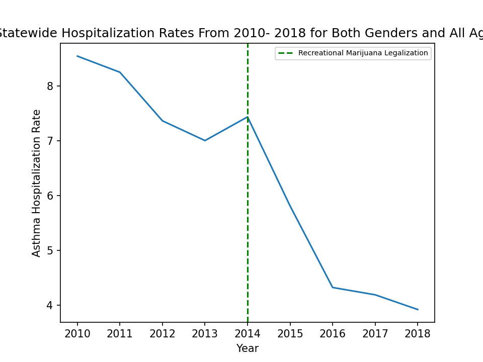
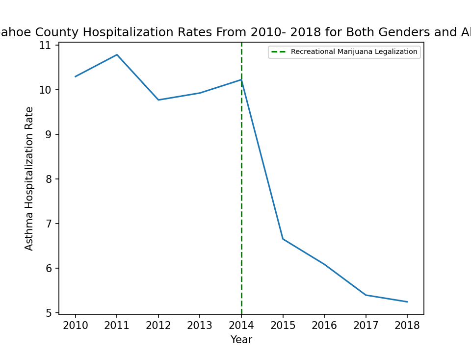
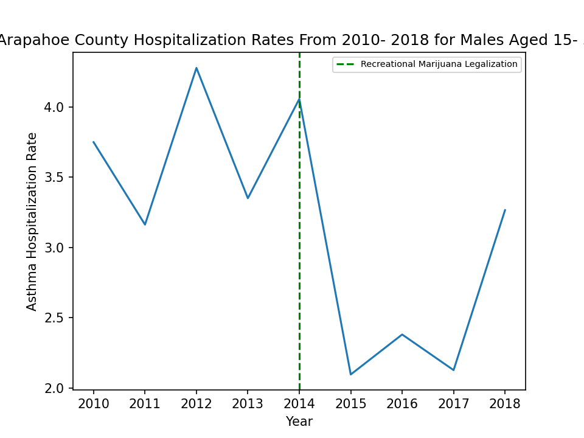

# Recreational Marijuana Legalization and Asthma Hospitalizations: Is their a correlation?
## Backround and Motivation {need to finish and cite}
According to the CDC asthma is one of the most common long term diseases impacting children, though it can also effect adults. When an Asthma attack occurs it can causes wheezing, breathlessness, chest tightness, and coughing {anything about more serious conditions or maybe my experience with Brett}. Asthma attacks are brought on by asthma triggers of which tobacco smoke is one of the most commmon triggers.

With states around the country, including Colorado, legalizing both medical and recreational marijuana I wanted to see if it's legalization had any measurable impacts asthma hospitalization rates in Colorado.

## Data
In order to answer the above question I took a look at the Colorado Department of Public Health and Environment (CDPHE) Asthma Hospitalization Data available on <a href="https://data-cdphe.opendata.arcgis.com/datasets/colorado-epht-asthma-hospitalization-data/data">CDPHE's Open Data website</a>. This data set includes county-level and state data on rates of hospitalizations, due to diagnosis of asthma, amoung Colorado residents between 2004- 2018. In addition it's also broken down gender and five different age groups. This data was published by the Colorado Environmental Public Health Tracking project. {include this or somthing more about how the rates calculated? citation?} Retial sale of recreational marijuana was allowed starting on January 1st, 2014 so I chose to look at data four years before and four years after legalization.

## Exploratory Data Analysis

[Figure 1.1]
    

        
    

 

[Figure 1.2]
    

        
    

 

[Figure 1.3]
    

        
    

 
## Has Legalization of Recreational Marijuana had a Measurable Impact?
[Figure 1.4]
    

        
    

 

## Lessons Learned

## Sources
1) https://data-cdphe.opendata.arcgis.com/datasets/colorado-epht-asthma-hospitalization-data/data
2) https://www.cdc.gov/asthma/faqs.htm#attack1
3) https://www.colorado.gov/pacific/sites/default/files/13%20Amendment%2064%20LEGIS.pdf
