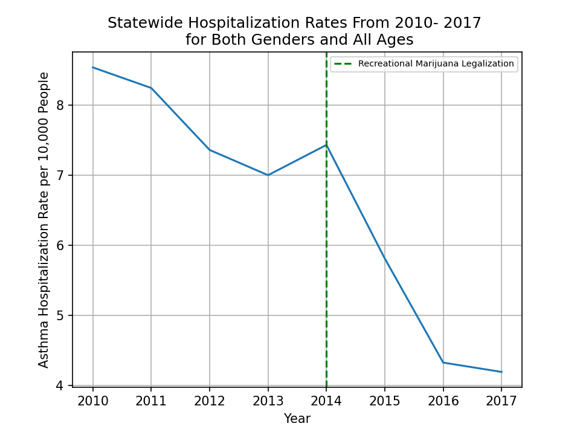

# Is there a Correlation Between Marijuana Legalization and Asthma Hospitalizations
## Background and Motivation
According to the CDC, asthma is one of the most common chronic diseases impacting children and adults. When an asthma attack occurs, it can cause wheezing, breathlessness, chest tightness, and coughing. Although asthma attacks are often short lived and treated at home with inhaled medications, occasionally the attacks become so serious they require a trip to the emergency room and admission to the hospital.  Asthma attacks are brought on by asthma triggers and smoke is one of the worst offenders. 

With states around the country, including Colorado, legalizing recreational marijuana I wanted to see if it's legalization had any measurable impact asthma hospitalization rates.

## Data
In order to answer the above question, I looked at the Colorado Department of Public Health and Environment (CDPHE) Asthma Hospitalization Data available on <a href="https://data-cdphe.opendata.arcgis.com/datasets/colorado-epht-asthma-hospitalization-data/data">CDPHE's Open Data website</a>. This data set includes county-level and state data on rates of hospitalizations among Colorado residents between 2004- 2018. A hospitalization is defined as an emergency room visit or an inpatient stay.  Hospitalization rates are calculated using discharges per 10,000 individuals. This dataset contains aggregated rates for both genders and all ages but also breaks those same rates down by gender and five different age groups. This data was published by the Colorado Environmental Public Health Tracking project. Retail sale of recreational marijuana was allowed starting on January 1st, 2014 so I chose to look at data four years before and four years after this date.

## Exploratory Data Analysis
### What Does the Statewide Trend Look Like?
After importing my data into pandas, and doing some basic cleaning, my first goal was to look at only statewide data for both genders and all age groups. I was surprised that out of more than 20,000 rows this only returned 8, but the trend being shown was interesting and unintuitive. Though the rate did jump slightly in 2014, when legalization occurred, the overall trend between 2010 and 2017 was a sharp decrease as shown below.

[Figure 1.1]
    

        
    

 

### What About the Trend in Just One County?
As a comparison I also took a look at the rates for both gender and all ages in just Arapahoe county. I chose Arapahoe county because it is both one of the most populous counties in Colorado and the one I live in. As you can see below the trend is almost identical.

[Figure 1.2]
    

        
    

 

### What About the Trend for Children Aged 0 to 4 in Arapahoe County?
[Figure 1.3]
    

        
    

 

### What About the Trend for Males Aged 15 to 34 in Arapahoe County?
As one final basic comparison, I took a look at the rates for my specific age group. Again, the results are almost identical though they are much more erratic.

[Figure 1.4]
    

        
    

 

## Has Legalization of Recreational Marijuana had a Measurable Impact?
From my prior analysis it appears as though overall asthma hospitalization rates have actually decreased. In order to more confidently state that rates have decreased a hypothesis test was performed under the following under the following conditions: 

* **Null Hypothesis((H0):** The rates did not change and thus sample means are the same
* **Alternate Hypothesis((HA):** The rates did  change
* **Significance Threshold(alpha):** 0.05

Due to the limited number of data points that had been used in my prior analysis I instead used data from all counties, separate genders, and the five different age groups. This required additional EDA as there were a significant number of zero and null values in the non-aggregated data. Out of the more than 20,000 rows, removing zero and null values left me with only 599 rows for the pre-legalization sample and 518 for the post-legalization sample. Performing a two-tailed t-test on these two samples resulted in:

<b> p-value = 3.70e-07 </b>
                                            
The results of this t-test allowed me to reject the null hypothesis and confirm that asthma hospitalization rates did change.

In order to confirm the decrease I saw in my prior analysis I plotted the PDF of both pre-legalization and post-legalization samples.

[Figure 1.5]
    

        
    

 

## Conclusions
While my analysis shows that asthma hospitalization rates post-legalization actually fell it does not allow me to show any correlation between marijuana legalization and these rates. This is for a number of reasons:

* Other factors, that have not been explored, could have contributed to this decrease such as an increased awareness of asthma triggers by the general population. The Colorado Environmental Public Health Tracking project, which published this data, may have included some sort of awareness campaign.

* Incomplete data could be skewing the results. During my analysis of the data there were a substantial number of null and zero values as well counties who only reported data for certain  genders or age ranges. The authors of this data set also acknowledge that it does not include hospital or emergency department discharges from Federal facilities in Colorado, such as U.S. Department of Veterans Affairs Medical Centers. I haven’t looked into how  hospitals or emergency departments that this may include, but I imagine it could it account for large number in the state.

* No specific data on marijuana usage was analyzed.

## Areas for Improvement
* Throughout the later half of my project I had it in my mind that my data was normally distributed which seemed plausible. It wasn't until 11 PM the night before my presentation as I was trying to check final items off my list that actually plotted the data on a histogram. It did not appear to be normally distributed. I decided not to redo all the work I had done, but for future projects I need to check the distribution before proceeding with a hypothesis test.

* One particular comparison I would have liked to have done would be to further filter my pre and post data for only counties that included data from all both genders and each of the five age groups. This may have provided a more representative sample to look at.

## Sources
1) https://data-cdphe.opendata.arcgis.com/datasets/colorado-epht-asthma-hospitalization-data/data
2) https://www.cdc.gov/asthma/faqs.htm#attack1
3) https://www.colorado.gov/pacific/sites/default/files/13%20Amendment%2064%20LEGIS.pdf
