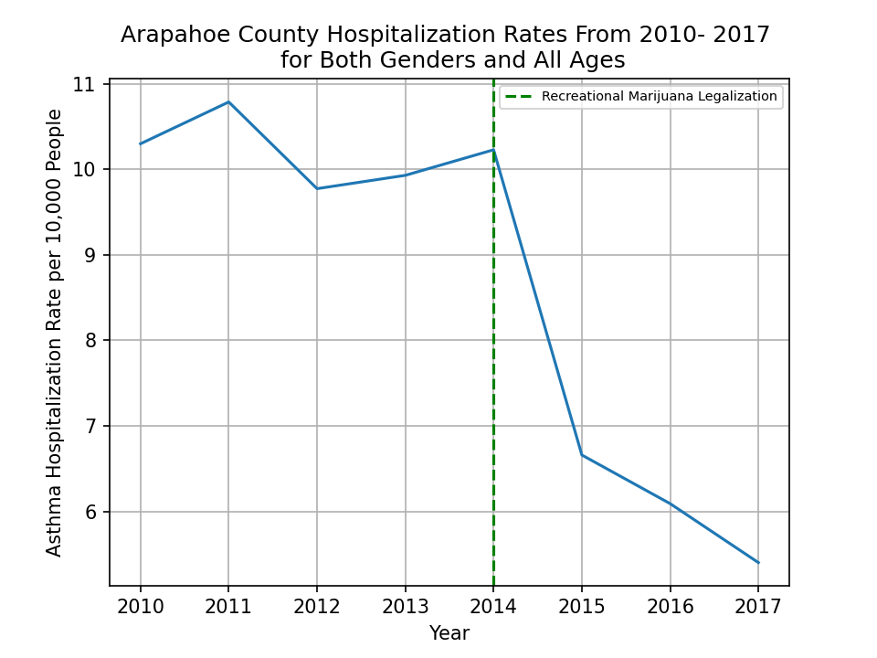

# Recreational Marijuana Legalization and Asthma Hospitalizations: Is their a correlation?
## Backround and Motivation {need to finish and cite}
According to the CDC asthma is one of the most common long term diseases impacting children, though it can also effect adults. When an Asthma attack occurs it can cause wheezing, breathlessness, chest tightness, and coughing {anything about more serious conditions or maybe my experience with Brett}. Asthma attacks are brought on by asthma triggers of which tobacco smoke is one of the most commmon.

With states around the country, including Colorado, legalizing recreational marijuana I wanted to see if it's legalization had any measurable impact asthma hospitalization rates.

## Data
In order to answer the above question I looked at the Colorado Department of Public Health and Environment (CDPHE) Asthma Hospitalization Data available on <a href="https://data-cdphe.opendata.arcgis.com/datasets/colorado-epht-asthma-hospitalization-data/data">CDPHE's Open Data website</a>. This data set includes county-level and state data on rates of hospitalizations among Colorado residents between 2004- 2018. Hospitalization rates are calculated using discharges per 10,000 individuals. This dataset contains aggregated rates for both genders and all ages, but also breaks has those same rates broken down by gender and five different age groups. This data was published by the Colorado Environmental Public Health Tracking project. Retail sale of recreational marijuana was allowed starting on January 1st, 2014 so I chose to look at data four years before and four years after this date.

## Exploratory Data Analysis
### What Does the Statewide Trend Look Like?
After importing my data into pandas, and doing some basic cleaning, my first goal was to look at only statewide data for both genders and all age groups. I was surprised that out of more than 20,000 rows this only returned 8, but the trend being shown was interesting and unintutive. Though the rate did jump slightly in 2014, when legalization occured, the overall trend between 2010 and 2017 was a sharp decrease as shown below.

[Figure 1.1]
    

        
    

 

## What About the Trend in Just One County?
As a comparison I also took a look at the rates for both gender and all ages in just Arapahoe county. I chose Arapahoe county because it is both one of the most populous counties in Colorado and the one I live in. As you can see below the trend is almost identical.

[Figure 1.2]
    

        
    

 

# What About the Trend for Children Aged 0 to 4 in That County?
{add my final graph here}

# What About the Trend for Males Aged 15 to 34 in That County?
As one final basic comparison I took a look at the rates for my specific age group. Again, the results are almost identical.

[Figure 1.3]
    

        
    

 

## Has Legalization of Recreational Marijuana had a Measurable Impact?
From my prior analysis it appears as though asthma hospitalization rates have actually decreased. In order to more confidently state that rates have decreased a hypothesis test was performed under the following under the following conditions: 

* **Null Hypthothesis(H0):** The rates did not change and thus sample means are the same
* **Alternate Hypthothesis(HA):** The rates did  change
* **Significance Threshold(alpha):** 0.05

Due to the limited number of data points that had been used in my prior analysis I instead used data from all counties, seperate genders, and the five different age groups. This required additional EDA as there were a significant number of zero and null values in the non aggregated data. Out of the more than 20,000 rows this left me with only 599 rows for the pre-legalization sample and and 518 for the post-legalization sample. Performing a two-tailed t-test on these two samples resulted in:

<b> p-value = 3.70e-07 </b>
                                            
The results of this t-test allowed me to reject the null hypothesis and confirm that asthma hospitalization rates did change.

In order to confirm the decrease I saw in my prior analysis I plotted the PDF of both pre-legalization and post-legalization samples.

[Figure 1.5]
    

        
    

 

## Conclusion
While my analysis shows that asthma hospitalization rates post-legalization actually fell it does not allow me to show any correlation betwen marijuana legalization and these rates. {more help with these last two sections}

## Lessons Learned
The authors of this data specific warn against making inferences from this data about environmental changes.

In the absence of more data looking at only data from those counties who reported rates for both genders and all age groups would present a more equal comparison.

## Sources
1) https://data-cdphe.opendata.arcgis.com/datasets/colorado-epht-asthma-hospitalization-data/data
2) https://www.cdc.gov/asthma/faqs.htm#attack1
3) https://www.colorado.gov/pacific/sites/default/files/13%20Amendment%2064%20LEGIS.pdf
