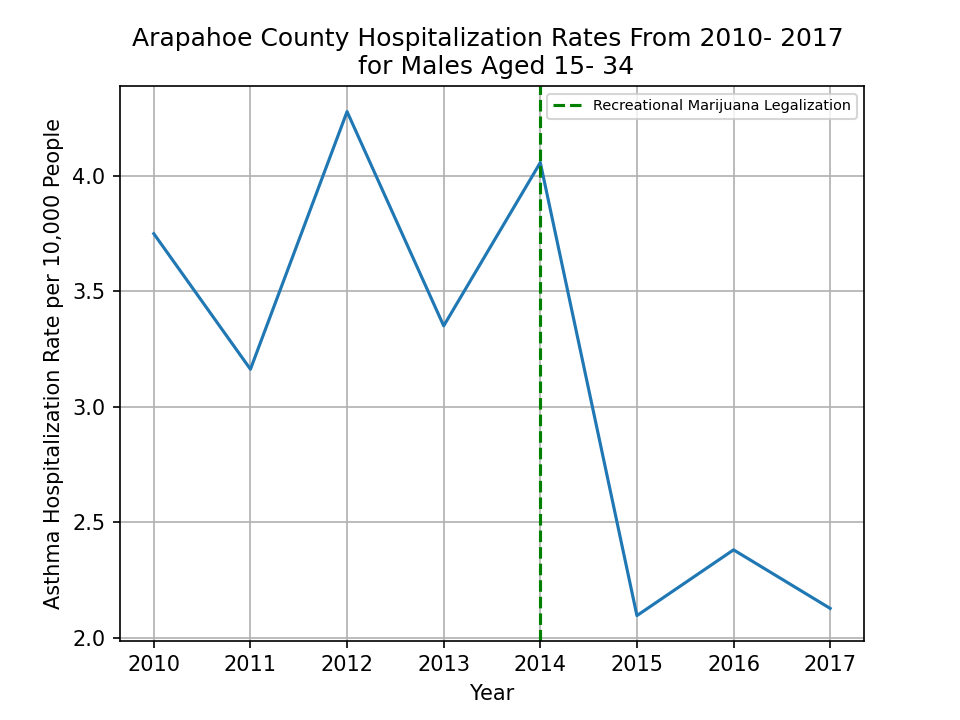

# Recreational Marijuana Legalization and Asthma Hospitalizations: Is their a correlation?
## Backround and Motivation {need to finish and cite}
According to the CDC asthma is one of the most common long term diseases impacting children, though it can also effect adults. When an Asthma attack occurs it can cause wheezing, breathlessness, chest tightness, and coughing {anything about more serious conditions or maybe my experience with Brett}. Asthma attacks are brought on by asthma triggers of which tobacco smoke is one of the most commmon triggers.

With states around the country, including Colorado, legalizing both medical and recreational marijuana I wanted to see if it's legalization had any measurable impacts asthma hospitalization rates.

## Data
In order to answer the above question I looked at the Colorado Department of Public Health and Environment (CDPHE) Asthma Hospitalization Data available on <a href="https://data-cdphe.opendata.arcgis.com/datasets/colorado-epht-asthma-hospitalization-data/data">CDPHE's Open Data website</a>. This data set includes county-level and state data on rates of hospitalizations, due to diagnosis of asthma, among Colorado residents between 2004- 2018. In addition it is also broken down gender and five different age groups. This data was published by the Colorado Environmental Public Health Tracking project. {include this or somthing more about how the rates calculated? citation?} Retail sale of recreational marijuana was allowed starting on January 1st, 2014 so I chose to look at data four years before and four years after legalization.

## Exploratory Data Analysis
### What Does the Statewide Trend Look Like?
After importing my data into pandas, and doing some basic cleaning, my first goal was to look at only statewide data for both genders and all age groups. I was was surprised that out of more than 20,000 rows this only returned 8 data points to look at, but the trend being shown was interesting an unintutive. Though the rate did jump slightly in 2014, when legalization occured, the overall trend between 2010 and 2017 was a sharp decrease as shown below.

[Figure 1.1]
    

        
    

 

## What About the Trend in Just One County?
As a comparison I also took a look at the rates for both gender and all ages in just Arapahoe county. I chose Arapahoe county because it's both one of the most populous counties in Colorado and the one I live in. As you can see below the trend is almost identical.

[Figure 1.2]
    

        
    

 

# What About the Trend for Males Aged 15 to 34?
As one final basic comparison I took a look at the rates for my specific age group. Again, the results are almost identical.

[Figure 1.3]
    

        
    

 

## Has Legalization of Recreational Marijuana had a Measurable Impact?
From my prior analysis it appears as though asthma hospitalization rates have actually decreased. In order to more confidently state that rates have decreased I removed the filters I had in place to return more aggregated data in order to increase my sample size before conducting a T-Test and finding a p-value. In removing those filters to look at data on the county-level for each gender, for each of the five age groups, and for all counties I discovered significant inconsistancies. Though there were some counties that had reported data for both genders and each of the five age groups many did not. I'll disccuss this furthur in my lessons learned section, but to be as inclusive as possible used all data that at least had a rate, a gender, and an age group.

I chose to use Welches T-test because because both of my sample sizes and variances were unequal. My null hypothesis was that the means of both samples were equal and my alternate hypothesis is that they are not. I first calculated Welches T-statistic and then used welch satterwithe to calculate degrees of freedom. Finnally, I plotted the p-value Region, as shown below, and calculated the p-value.

[Figure 1.4]

With a p- value of 3.7040031153345865e-07 as shown above I was able to reject the null hypothesis. Once rejected I still needed to answer the question did it difinitivly decrease. To do this I plotted the probability dencisty function

for each sample from my data sets normal dis pdf of 

[Figure 1.5]
    

        
    

 

## Lessons Learned
The authors of this data specific warn against making inferences from this data about environmental changes.

In the absence of more data looking at only data from those counties who reported rates for both genders and all age groups would present a more equal comparison.

## Sources
1) https://data-cdphe.opendata.arcgis.com/datasets/colorado-epht-asthma-hospitalization-data/data
2) https://www.cdc.gov/asthma/faqs.htm#attack1
3) https://www.colorado.gov/pacific/sites/default/files/13%20Amendment%2064%20LEGIS.pdf
